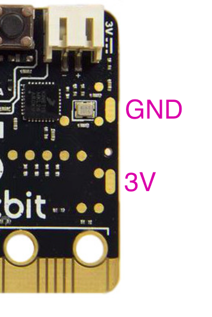

## Accessory list

A [list of available accessories](https://microbit.org/buy/accessories/) is maintained on the micro:bit website.

<a href="https://form.jotformeu.com/83453273451355" class="btn btn-cta">Submit an accessory</a>

## Using the edge connector

The micro:bit [card edge connector](/hardware/edge-connector/), commonly referred to as the 'edge connector' or the 'pins', is compatible with a standard 1.27mm, 2x40 edge connector socket.

Where possible your accessory design should implement this socket, making it simple for your users to plug in and remove the micro:bit board.

There are [limitations to the current that can be drawn from the micro:bit](/hardware/power-supply/), accessories must be designed carefully to ensure they do not damage the micro:bit, or that the micro:bit cannot damage them.

- [micro:bit edge connector and pinout](/hardware/edge-connector/)
- [powering accessories from the micro:bit](/hardware/power-supply/)

### V2 revision

The edge connector on the V2 board revision is backwards compatible with the V1 edge connector, but has additional dedicated pins.

## Battery pads

There are two rounded rectangular pads on the back of the micro:bit. These allow you to connect a battery holder via a mechanism other than the JST connector.

The upper pad is 0V or GND and the lower pad is 3V.

### V2 revision

In the V2 board revision, the 3V rounded rectangular pad is connected to the 3V ring on the edge connector.

- If you make an accessory that uses the rounded rectangular pads, it must be protected from reverse charging when the board is powered by USB, battery or edge connector.
- You can now source power from the rounded rectangular pads if you are making an accessory, as they are consistent with the power architecture of the edge connector.

Due to the addition of a speaker, current accessories that use the rounded rectangular pads to power the micro:bit will no longer fit.

