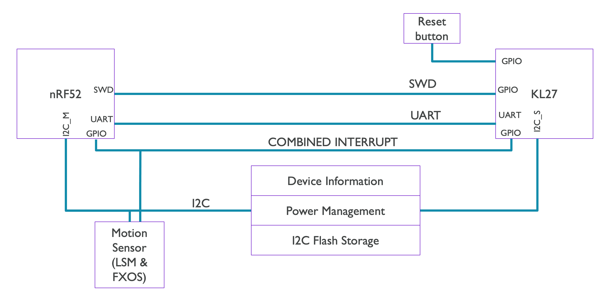

import Tabs from '@theme/Tabs';
import TabItem from '@theme/TabItem';

## Use of the I2C bus

<Tabs>
<TabItem value="v2" label="V2" default>

The I2C bus for the latest revision of the micro:bit separates the I2C signals into Internal and External use.

The internal signals run to the target Nordic chip and communicate with the motion sensor and interface chip.

The external lines run to the edge connector and can be used for accessories.

### I2C block diagram

### Table of addresses used

|                                   | accelerometer | magnetometer (compass) | Interface Mng    | Interface Storage |
|-----------------------------------|---------------|------------------------|------------------|-------------------|
| motion sensor variant 1 (LSM303AGR)  | 0x19 (0x32/0x33) | 0x1E (0x3C/0x3D) | 0x70 (0xE0/0xE1) | 0x72 (0xE4/0xE5) |
| motion sensor variant 2 (FXOS8700CQ) | 0x1F (0x3E/0x3F) | 0x1F (0x3E/0x3F) | 0x70 (0xE0/0xE1) | 0x72 (0xE4/0xE5) |

The V2 has a dedicated bus for on-board I2C peripherals. The V1 shares the same bus for on-board and external I2C devices — see the V1 tab for reserved addresses.

</TabItem>
<TabItem value="v1" label="V1">

The motion sensors on the board are on the same I2C bus as the edge connector I2C pins. This means that if you have an accessory that uses I2C on this bus, you need to check it won't clash with any of the possible on-board sensors.

The V1.5 micro:bit has a footprint for two different motion sensors: one made by ST (the LSM303AGR) and one by NXP (FXOS8700CQ). The micro:bit DAL supports both of these sensors, detecting them at runtime. To date, all V1.5 boards have been manufactured with the LSM303AGR, however we may switch to the NXP part. Before doing so we will perform a round of testing and notify the [DAL and Devices mailing list.](http://eepurl.com/dyRx-v)

### I2C block diagram

### Table of addresses used

|                     | accelerometer    | magnetometer (compass) |
|---------------------|------------------|------------------------|
| micro:bit V1.3 (MMA8653+MAG3110) | 0x1D (0x3A/0x3B) | 0x0E (0x1C/0x1D) |
| micro:bit V1.5 variant 1 (LSM303AGR) | 0x19 (0x32/0x33) | 0x1E (0x3C/0x3D)  |
| micro:bit V1.5 variant 2 (FXOS8700CQ) | 0x1F (0x3E/0x3F) | 0x1F (0x3E/0x3F) |

Overall, this means 0x1D, 0x0E (from v1.3), 0x1F and 0x19 (for the revision) are reserved for on-board use.

</TabItem>
</Tabs>

## I2C accessories

If you make an accessory for the micro:bit, please help us by editing the table below and sharing the details of the I2C addresses you use.

| accessory name | organisation | I2C address(es) used |
|----------------|--------------|-----------------------|
| [EDU:BIT](https://www.cytron.io/p-edubit-training-and-project-kit-for-microbit)| Cytron Technologies | 0x08 (0x10/0x11) |

### Acceptable capacitance for I2C accessories

In our recent testing for the motion sensor change, we found that a 10nF cap connected SCL-GND slowed down the I2C bus, but it continued to operate. Separately, capacitance was added to SDA until it ceased operation:

- 100KHz continued with 1nF but failed with 2nF.
- 400kHz continued with 150pF but failed with 180pF.

No difference was seen between the revisions.

## Notes

The V2 device can be woken by activating (by pulling low) the combined sensor interrupt on P0.25. This open drain signal is connected between the target MCU, the Interface MCU, and motion sensors and requires the target MCU internal pull up to be configured, even while the device is sleeping.
